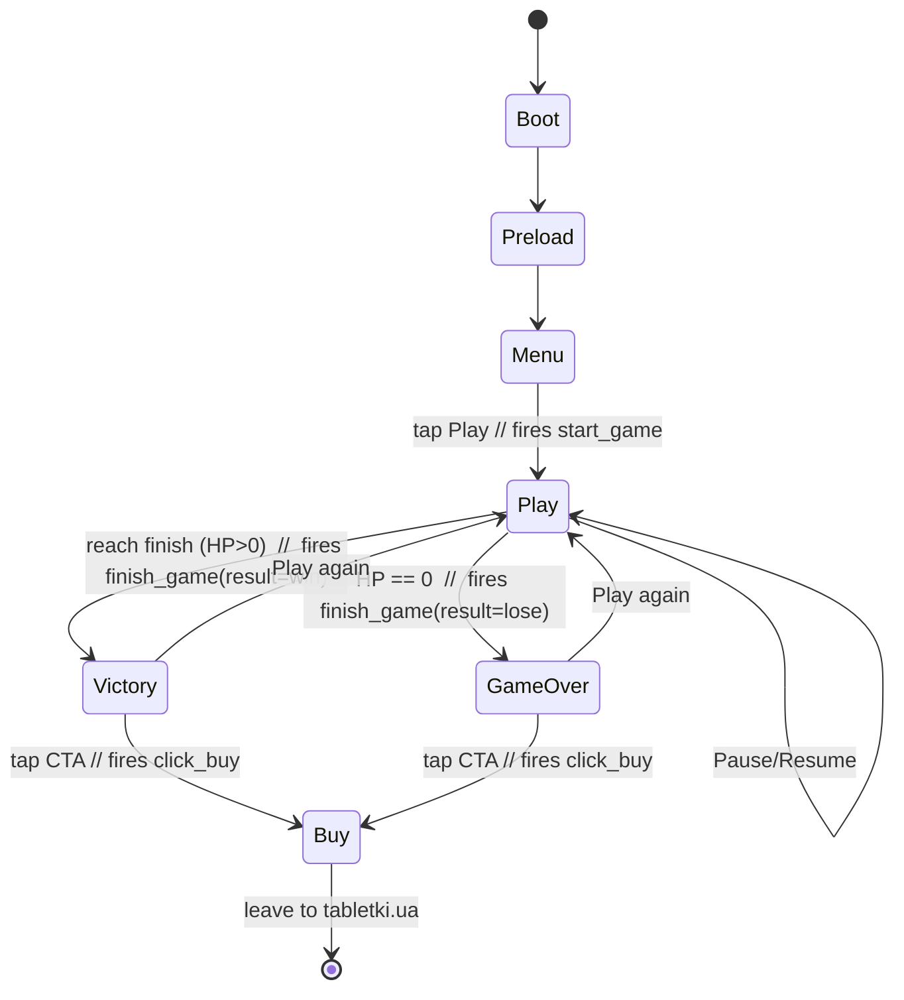

# Game Specification — 2D Browser Runner (Working title: *Happy Dog Runner*)

**Document type:** Product & technical specification (buildable scope for estimate)
**Status:** Draft for client confirmation
**Source of requirements:** [`docs/2d-browser-runner-bi-brief.md`](./2d-browser-runner-bi-brief.md) (client cost-estimation brief, English translation)
**Date:** 2026-07-23

> **How to read this document.** The client brief is the source of *requirements*. A product interview then locked a set of *decisions* that resolve the brief's open ambiguities (e.g. endless vs. finite, MVP vs. phase 2). Where a locked decision narrows or overrides the brief, this spec follows the decision and says so. Section 11 lists what still needs client confirmation before a firm cost/timeline can be committed.

---

## 1. Overview & Goals

### 1.1 What we are building

A **mobile-first, branded 2D browser runner** that promotes a dog flea-and-tick tablet. The player controls a hero dog that auto-runs through a park, jumps over obstacles, avoids **ticks**, and collects **tablets**. The round is a **finite single level (~60–90 s)** ending in **Victory** (reach the finish line) or **Game Over** (lose all health). After the round, a single call-to-action surfaces a **promo code** and links to **[tabletki.ua](http://tabletki.ua)** to buy the product.

This is an advergame: the gameplay is the vehicle, and the marketing outcomes are the point.

### 1.2 Marketing objective

Per the brief (§1), two goals:

1. **Awareness** — teach, through play, that ticks are a threat and the tablet is the protection. The "tablet as armor" power-up (§3.7) makes the product mechanic *be* the protection.
2. **Conversion** — drive tablet purchase via the post-round CTA to tabletki.ua (brief §3, "CTA button").

### 1.3 Audience

Dog owners on **mobile web**, reached through paid social / display where Meta Pixel and GA4 attribution matter. Casual players; sessions are short and one-handed. UI language assumed **Ukrainian primary**, built i18n-ready (see §11).

### 1.4 Success signals (tied to the three analytics events)

The entire funnel is observable through three events (full contract in §7):

| Funnel stage | Signal | Event |
|---|---|---|
| Engagement | Player starts a round | `start_game` |
| Completion & quality | Player finishes (win or lose), with score & duration | `finish_game` (`result`, `score`, `duration_s`) |
| **Conversion** | Player taps the buy CTA | `click_buy` (`destination`, `promo_code`) |

Primary KPI is `click_buy / start_game` (intent-to-purchase rate). `finish_game` with `result=win` vs. `lose` and `duration_s` tells us whether difficulty is tuned so players actually reach the CTA.

---

## 2. Platforms & Performance Targets

### 2.1 Platform priority

**Mobile web first**, desktop supported (brief §2). Touch is the primary input; desktop uses tap/click and spacebar.

### 2.2 Supported browser matrix

| Tier | Browser / OS | Support level |
|---|---|---|
| Primary | iOS Safari (last 2 major versions) | Fully supported, primary QA target |
| Primary | Android Chrome (last 2 major versions) | Fully supported, primary QA target |
| Secondary | Desktop Chrome / Edge / Firefox (current) | Fully supported |
| Secondary | Desktop Safari (current) | Fully supported |
| Best-effort | Samsung Internet, mobile Firefox | Should work; not a QA gate |

### 2.3 Performance budget (assumed — **flag for confirmation**, see §11)

Because the brief sets no numbers, we propose these targets. They drive art budgets and QA gates and must be confirmed:

| Metric | Target | Notes |
|---|---|---|
| Frame rate | 60 FPS on mid-range phones; **≥30 FPS floor** on low-end (≈2–3-year-old Android) | Gameplay must never dip below the floor |
| Time-to-interactive (first load, warm CDN) | **≤3 s** on a 4G connection | Menu interactive |
| Initial download (gzipped) | **≤4–6 MB** total (code + assets) | Aggressive for an advergame; see §10.5 |
| Input latency (tap → jump) | ≤1 frame of processing | Tap responsiveness is the whole game |
| Orientation | Portrait-first; graceful landscape | Confirm preferred orientation |

These are the recommended KPIs to lock in §11.

---

## 3. Gameplay Design

### 3.1 Core loop

```
auto-run forward  →  read upcoming hazard  →  tap to jump  →  land / collect / take hit
      ↑                                                                    │
      └──────────────────── repeat until finish line or 0 HP ──────────────┘
```

The player does exactly one thing — **time jumps** — against a scrolling stream of obstacles, ticks, and tablets. Skill = timing and reading density as speed ramps.

### 3.2 Controls (locked)

**Auto-run + tap-to-jump ONLY.** No duck/slide, no lane-switching in MVP.

| Input | Platform | Action |
|---|---|---|
| Tap anywhere on canvas | Mobile | Jump |
| Spacebar / click | Desktop | Jump |
| Pause button (HUD) | All | Pause / resume |
| Mute button (HUD) | All | Toggle audio |

- Single jump (no double-jump in MVP). Jump arc is fixed height/duration, tuned so a well-timed tap clears one obstacle.
- Jump is **edge-triggered** (fires on press, not hold) and ignored while airborne.

> Duck/slide is explicitly **deferred to phase 2** (§9). Spec'd here as absent so level design assumes a jump-only vocabulary.

### 3.3 Entities

| Entity | Role | Behavior |
|---|---|---|
| **Hero dog** | Player avatar | Auto-runs; fixed screen X; jumps on input; has HP |
| **Tick** | Damaging obstacle / enemy | Ground or low-flying hazard; collision = **−1 HP**. The thing you must avoid |
| **Environmental obstacle** (bush / puddle) | Jump obstacle | Per brief §3A; collision = **−1 HP** (treated as a hazard you jump). *Assumption: same damage model as tick; confirm if bush/puddle should be harmless-but-blocking instead* (§11) |
| **Tablet** | Collectible (the product) | Pickup = **+score** and **+1 HP** up to the 3-heart cap |
| **Armor / shield pickup** | Timed power-up | Pickup = temporary invulnerability (see §3.7) |
| **Finish line** | Level end | Reaching it = Victory |

> **Note on tick damage.** The brief (§2) describes ticks as "remove health / **deduct points**." This spec **intentionally replaces the points-deduction reading with HP-only damage** (−1 HP, no score penalty): it's simpler to communicate, and avoids negative-score confusion for a casual mobile audience. Score only ever goes up (§3.5).

### 3.4 Health rules (locked)

- Player starts with **3 HP**, shown as 3 hearts.
- **Tick collision: −1 HP.** Environmental-obstacle collision: −1 HP (see assumption above).
- **Tablet pickup: +1 HP**, capped at 3 (never exceeds the 3-heart max).
- **0 HP → Game Over.**
- On taking damage: brief invulnerability/blink window (~1 s) + hit animation, so a single obstacle can't drain multiple hearts in one contact.

### 3.5 Scoring (locked direction)

- **Tablets collected → +score** (primary source; ties score to the product).
- **Distance / survival → +score** over time (secondary, keeps score moving).
- Score is displayed live in the HUD and reported in `finish_game` (§7).
- **Combo / score-multiplier is deferred to phase 2** (§9). MVP score is a straight sum.

*Exact point values (e.g. tablet = 100, per-second = 10) are tuning parameters, set during playtest.*

### 3.6 Win / lose conditions (locked)

| Outcome | Trigger | Result screen | Analytics |
|---|---|---|---|
| **Victory** | Reach the finish line with ≥1 HP | Victory screen | `finish_game` `result:'win'` |
| **Game Over** | HP reaches 0 before finish | Game Over screen | `finish_game` `result:'lose'` |

Both screens surface the same buy CTA (§6.4).

### 3.7 Armor power-up (locked — optional feature IN MVP)

Per brief §3 ("medication as Armor", Crash-Bandicoot-mask principle):

- A distinct **Armor/shield pickup** appears occasionally in the level.
- On pickup: hero gains **temporary total invulnerability** — tick/obstacle collisions do **no damage** for the duration.
- **Distinct visual:** a shield aura / mask-style overlay on the dog (brief's Crash-Bandicoot mask reference), plus a countdown/expiry tell (aura flashes as it runs out).
- Duration is a tuning parameter (proposed **~4–6 s**).
- While armored, hitting a tick still consumes/destroys the tick (feels powerful) but costs no HP.
- Reinforces the marketing message: *the tablet is the protection.*

### 3.8 Difficulty progression (locked)

The level ramps over its ~60–90 s so the finish feels earned:

- **Scroll speed** increases in stages from start to finish.
- **Obstacle & tick density** increases (tighter spacing, more frequent hazards).
- **Tablet/armor generosity** tapers slightly late-game to raise tension near the finish.
- Ramp is authored/curve-driven (not purely random) so difficulty is repeatable and tunable. Spacing always stays clearable with jump-only controls (§3.2).

### 3.9 Session length & level termination (locked)

**One finite level, ~60–90 s.** Not endless. This keeps sessions short, guarantees most players reach a result screen (and thus the CTA), and bounds art/level-authoring scope.

**Level length is distance-based.** The level is a fixed **world distance** measured in world units — `LEVEL_LENGTH` (a `gameConfig` tuning value) — sized so that traversing it at the base scroll speed takes the target **~60–90 s**. (Because the difficulty ramp *increases* speed over the run (§3.8), the actual traversal time is somewhat under the base-speed figure; `LEVEL_LENGTH` is tuned against the full speed curve during playtest to land in the 60–90 s window.) Player progress is tracked as distance travelled toward `LEVEL_LENGTH`, and the HUD progress bar (§6.2) maps to `distance / LEVEL_LENGTH`.

**Finish-line spawn rule:** a **FinishLine** entity is spawned once, at world position `LEVEL_LENGTH` (the end of the level distance). No further obstacles/ticks spawn past it. When the hero reaches/overlaps the FinishLine with ≥1 HP, the run ends in **Victory** (§3.6).

---

## 4. Content & Art Requirements

> Per brief §3A, the estimate must separate **Code** from **Design/Animation**. This section is the Design/Animation manifest. Art style: **cartoon/casual mobile**, single **park** theme.

### 4.1 Hero dog — 5 animation states (brief §3A)

**MVP ships ONE hero dog** (breed selection deferred, §9). That one dog needs all five states:

| # | Animation | Trigger |
|---|---|---|
| 1 | **Run** | Default auto-run loop |
| 2 | **Jump** | On tap (rise + fall; can be one clip or 2-part) |
| 3 | **Damage / hit** | On taking −1 HP |
| 4 | **Victory** | Victory screen / crossing finish |
| 5 | **Defeat** | Game Over |

Delivered as a **spritesheet/texture atlas** with frame data (see §8.4). *(Bonus "armored run" tint/overlay can be a shader/tint on the run loop rather than a separate sheet — cost-saving.)*

### 4.2 Environment — park (brief §3A)

- Single **park** theme.
- **1–2 parallax background layers** (e.g. far skyline/treeline + near foliage) scrolling at different speeds for depth.
- Repeating ground/path tile.
- Optional light foreground layer (grass tufts) if budget allows.

### 4.3 Enemies, collectibles, obstacles

| Asset | Count | Notes |
|---|---|---|
| **Tick** | 1 type | Idle/approach animation (small loop or single frame with wobble) |
| **Tablet** (brand product) | 1 type | Should read as the actual product; gentle spin/shine loop |
| **Environmental obstacles** | 1–2 types | Bush and/or puddle (brief §3A) |
| **Armor / shield pickup** | 1 | Distinct mask/shield icon; pickup burst VFX |

### 4.4 Armor VFX

- Pickup burst (on collect).
- Active-shield aura/overlay on the dog (persistent during duration).
- Expiry tell (flash/fade in final ~1 s).

### 4.5 UI screens (art) — brief §3A UI/UX

- **Main menu** (title, Play, mute, branding).
- **HUD** (score, hearts, progress/timer, pause, mute).
- **Victory** results screen (score + CTA).
- **Game Over** results screen (score + CTA).
- **Pause** overlay.
- Shared UI kit: buttons, hearts (full/empty), promo-code chip, iconography.

> The brief lists a **dog-selection screen** under UI. Because breed select is **deferred to phase 2**, that screen is **not** an MVP art deliverable (roadmap only, §9).

### 4.6 Audio asset list (locked — sound IN MVP)

| Asset | Type | Use |
|---|---|---|
| Jump SFX | one-shot | On jump |
| Hit SFX | one-shot | On −1 HP |
| Pickup SFX | one-shot | On tablet/armor collect |
| Victory sting | short | Victory screen |
| Game Over sting | short | Game Over screen |
| Music loop | short seamless loop | Background during play |
| (Mute state) | — | Handled in code (§6.3), persists across screens |

Audio must respect the **iOS Safari audio-unlock** requirement (§10.2).

---

## 5. Screen Flow & State Machine

### 5.1 Flow



### 5.2 Where each analytics event fires

| Transition | Event | Notes |
|---|---|---|
| Menu → Play (round begins) | **`start_game`** | Fired once as the Play scene starts the run |
| Play → Victory | **`finish_game`** `result:'win'` | With `score`, `duration_s` |
| Play → Game Over | **`finish_game`** `result:'lose'` | With `score`, `duration_s` |
| Results → tap CTA | **`click_buy`** | With `destination`, `promo_code`; then navigate to tabletki.ua |

"Play again" re-enters Play and fires a fresh `start_game`.

---

## 6. UI / HUD Spec

### 6.1 Main menu

- Game title + branding (logo — see §11).
- **Play** button (primary).
- Mute toggle.
- Optional: short "how to play" hint ("Tap to jump — dodge the ticks!").
- (Phase 2: breed-select entry point — hidden in MVP.)

### 6.2 In-game HUD (brief §3A: score, HP, timer/progress)

Persistent, minimal, thumb-safe:

| Element | Position (proposed) | Content |
|---|---|---|
| **Score** | Top-left | Live numeric score |
| **HP hearts** | Top-center or top-left under score | 3 hearts, filled/empty |
| **Level progress** | Top, full-width thin bar **or** countdown timer | Distance-to-finish (progress bar preferred; shows the finish is coming) |
| **Pause** | Top-right | Opens pause overlay |
| **Mute** | Top-right (next to pause) | Toggles audio |

Progress bar preferred over a raw timer because it visualizes "the finish line is near," which encourages completion (and CTA exposure).

### 6.3 Pause & mute

- **Pause overlay:** dims play, shows Resume + Mute + (optional) Quit-to-menu. Game clock and scrolling freeze.
- **Mute:** toggles all audio; state **persisted** (localStorage) across scenes and sessions. Reflected by icon in menu, HUD, and pause.

### 6.4 Results screens (Victory & Game Over) — the CTA

Both screens share a layout; only framing/art differ:

| Element | Victory | Game Over |
|---|---|---|
| Headline | "You made it! 🐕" | "Ticks got you…" |
| Final score | shown | shown |
| Result art | Victory dog pose | Defeat dog pose |
| **Buy CTA (single)** | Promo code + "Buy on tabletki.ua" | same |
| Secondary | "Play again" | "Play again" |

**CTA (the `click_buy` conversion, locked):**
- **One** primary call-to-action on the results screen.
- Displays a **promo code** (copyable) and a button linking to **tabletki.ua**.
- **Campaign attribution:** the tabletki.ua buy URL carries **UTM parameters** (`utm_source`, `utm_medium`, `utm_campaign` — e.g. `?utm_source=happydogrunner&utm_medium=game&utm_campaign=tick_protection`) so purchases completed on tabletki.ua can be attributed back to the game/campaign. UTMs are carried **alongside** (not instead of) the promo code. Exact UTM values are configured with the final buy URL (§11).
- On tap: fire `click_buy` (`destination:'tabletki.ua'`, `promo_code`) **then** navigate to the UTM-tagged URL (new tab on desktop; confirm same-tab vs new-tab behavior for mobile in §11).
- **No client-site path in MVP** — tabletki.ua only.

---

## 7. Analytics & Tracking Spec

### 7.1 Adapter design

A **thin `track(event, params)` adapter** is the single choke point for all analytics. Game code never calls `gtag`/`fbq` directly — it calls `track()`, which fans out to **GA4 (gtag)** and **Meta Pixel (fbq)**.

```ts
type AnalyticsEvent = 'start_game' | 'finish_game' | 'click_buy';

function track(event: AnalyticsEvent, params: Record<string, unknown> = {}): void {
  // GA4
  window.gtag?.('event', event, params);
  // Meta Pixel — custom events via trackCustom
  window.fbq?.('trackCustom', event, params);
  // Dev/QA: console mirror when a debug flag is on
  if (DEBUG_ANALYTICS) console.debug('[track]', event, params);
}
```

Rationale:
- **One contract, two sinks.** Adding/removing a sink (or a consent gate) is a one-file change.
- **Safe if a pixel is absent.** Optional chaining means a missing/blocked `gtag`/`fbq` never throws (ad-blockers are common on the audience).
- **Testable.** Event emission can be asserted in isolation.

### 7.2 Event / parameter contract

#### `start_game` — a round begins

| Param | Type | Required | Example | Notes |
|---|---|---|---|---|
| *(none required)* | — | — | — | Fired once when the Play scene starts the run |

#### `finish_game` — fires on BOTH Victory and Game Over

| Param | Type | Required | Example | Notes |
|---|---|---|---|---|
| `result` | `'win' \| 'lose'` | ✅ | `'win'` | `win` = reached finish; `lose` = 0 HP |
| `score` | integer | ✅ | `1450` | Final score at round end |
| `duration_s` | integer (seconds) | ✅ | `72` | **Active play time, excluding paused time.** Measured by accumulating elapsed time each frame while the run is playing; the accumulator is **frozen while paused** (§6.3) so paused time never inflates it. Reported at round end |

#### `click_buy` — CTA tapped on results screen

| Param | Type | Required | Example | Notes |
|---|---|---|---|---|
| `destination` | string | ✅ | `'tabletki.ua'` | Fixed for MVP |
| `promo_code` | string | ✅ | `'DOG10'` | The code shown on the CTA (see §11) |

> All three event **names** are fixed by the brief (§3B: `start_game`, `finish_game`, `click_buy`) — do not rename.

### 7.3 GA4 (gtag) + Meta Pixel (fbq) wiring

- Both snippets load in `index.html` `<head>` (standard install), parameterized by **GA4 Measurement ID** and **Meta Pixel ID** (see §11 — needed before launch).
- IDs injected via Vite env vars (`VITE_GA4_ID`, `VITE_FB_PIXEL_ID`) so staging/prod differ without code edits.
- GA4 receives events via `gtag('event', …)`; Meta Pixel via `fbq('trackCustom', …)`. (Meta standard events like `Purchase` are **not** used — the brief's three custom names take priority; a `Purchase` mapping can be added later if the client wants Ads Manager optimization on it.)
- **GA4 custom dimensions/metrics:** the custom params (`result`, `score`, `duration_s`, `destination`, `promo_code`) must be **registered as custom dimensions/metrics in the GA4 property** (GA4 Admin → Custom definitions) or they will be collected but **won't surface in GA4 reports**. Register `result`/`destination`/`promo_code` as dimensions and `score`/`duration_s` as metrics as part of launch setup.

### 7.4 Consent / GDPR note

- The audience is EU-adjacent (Ukraine); ad pixels imply personal-data processing.
- **Recommendation:** a lightweight consent gate. `track()` is the natural enforcement point — buffer or drop events until consent is granted, and only initialize `fbq`/`gtag` post-consent (Consent Mode v2 for GA4).
- Exact consent UX / whether a CMP is required depends on the client's legal stance — **flag in §11.** MVP ships the adapter consent-ready even if the banner is deferred.

---

## 8. Technical Architecture

### 8.1 Stack (locked)

**Phaser 3 + TypeScript + Vite**, shipped as a **100% static site** (Cloudflare Pages or Netlify). **No backend/server.** (Brief §3B leaves engine to us and asks for "something simple"; Phaser 3 is the standard, well-supported HTML5 2D choice.)

**Engine configuration:**
- **Physics:** Phaser **Arcade Physics** — the lightweight AABB engine, sufficient for a jump-and-collide runner and the cheapest option for the low-end-phone perf floor (§2.3). No need for Matter.js.
- **Scale mode:** `Phaser.Scale.FIT` with `autoCenter: Phaser.Scale.CENTER_BOTH` — the game renders at a fixed logical resolution and scales to fit any viewport while centered, which is the mobile-friendly default for the portrait-first target (§2.3) across the device matrix (§2.2).

### 8.2 Proposed project structure

```
/
├─ index.html                # GA4 + Meta Pixel snippets, canvas mount
├─ vite.config.ts
├─ public/
│  └─ assets/                # atlases, audio, fonts (hashed on build)
├─ src/
│  ├─ main.ts                # Phaser.Game bootstrap + config
│  ├─ scenes/
│  │  ├─ BootScene.ts        # config, scale mode, input setup
│  │  ├─ PreloadScene.ts     # load atlases/audio + loading bar
│  │  ├─ MenuScene.ts        # main menu (fires nothing)
│  │  ├─ GameScene.ts        # the run: spawn, collide, HP, score
│  │  └─ ResultsScene.ts     # Victory/Game Over + CTA (win/lose param)
│  ├─ entities/
│  │  ├─ HeroDog.ts          # run/jump/hit/win/lose states + HP
│  │  ├─ Tick.ts
│  │  ├─ Tablet.ts
│  │  ├─ Obstacle.ts         # bush/puddle
│  │  ├─ ArmorPickup.ts
│  │  └─ FinishLine.ts       # spawned at LEVEL_LENGTH; overlap = Victory
│  ├─ systems/
│  │  ├─ Spawner.ts          # difficulty-curve-driven spawning
│  │  ├─ DifficultyCurve.ts  # speed/density ramp over the level
│  │  └─ AudioManager.ts     # SFX/music + mute persistence + iOS unlock
│  ├─ analytics/
│  │  └─ track.ts            # the track() adapter (§7)
│  ├─ ui/
│  │  ├─ Hud.ts              # score, hearts, progress, pause, mute
│  │  └─ PauseOverlay.ts
│  ├─ config/
│  │  ├─ gameConfig.ts       # HP, jump, speeds, durations (tuning)
│  │  └─ env.ts              # VITE_* ids, promo code, buy URL
│  └─ i18n/
│     └─ strings.ts          # UA strings, i18n-ready (§11)
```

### 8.3 Phaser Scene breakdown

| Scene | Responsibility | Analytics |
|---|---|---|
| **Boot** | Game config, scale/resize mode, input, load minimal boot assets | — |
| **Preload** | Load all atlases/audio; show loading bar; wire iOS audio-unlock | — |
| **Menu** | Title, Play, mute | — |
| **Game** | The run — spawner, collisions, HP, score, HUD, pause, armor | fires `start_game` on start; `finish_game` on end |
| **Results** | Victory/Game Over by param; score; promo CTA; Play again | fires `click_buy` on CTA |

### 8.4 Asset pipeline

- **Spritesheets → texture atlases** (packed `.png` + JSON frame data) for the dog and entities — one atlas draw call, fewer requests, good mobile GPU behavior.
- Audio as compressed `.m4a`/`.mp3` (+ `.ogg` fallback where useful); short loops.
- Vite **content-hashes** asset filenames for cache-busting; static host serves with long cache TTLs.
- Textures loaded in Preload with a visible loading bar.

### 8.5 Build & deployment

- `vite build` → static `dist/` (HTML, hashed JS/CSS, assets).
- Deploy `dist/` to **Cloudflare Pages or Netlify** — global CDN, no server.
- Env-specific IDs (GA4, Pixel, promo code, buy URL) via `VITE_*` build env vars.
- CI: build on push, deploy preview per branch, promote to prod.

---

## 9. Scope & Phasing

### 9.1 MVP (this spec)

- One finite park level (~60–90 s) with finish line.
- **One** hero dog with 5 animations (run/jump/hit/victory/defeat).
- Auto-run + tap-to-jump.
- 3 HP; tick/obstacle damage; tablet pickup (+score, +HP capped at 3).
- Ticks, bush/puddle obstacles, tablet collectibles.
- **Armor/shield** power-up (timed invulnerability, distinct VFX).
- Difficulty ramp (speed + density).
- **Sound** (SFX, music loop, mute toggle, iOS audio-unlock).
- Menu, HUD, Pause, Victory & Game Over screens.
- Single promo-code CTA to tabletki.ua.
- `track()` adapter → GA4 + Meta Pixel with the 3 events.
- Static deployment.

### 9.2 Phase-2 roadmap (deferred — spec'd, not built now)

| Deferred feature | Why deferred | What phase 2 adds |
|---|---|---|
| **5-breed character selection** | Brief lists 5 skins + a select screen; MVP proves the loop with one dog to control art cost & scope. **Whether this is committed is an open question (§11).** | 4 more dog atlases (×5 animations each) + dog-selection screen + persistence of choice |
| **Duck / slide mechanic** | Jump-only keeps controls and level-authoring simple for MVP and mobile ergonomics | Second input verb + low/overhead obstacles designed around it |
| **Combo / score-multiplier** | MVP scoring is a straight sum; multiplier is a retention/polish layer, not core | Combo tracking on tablet streaks, multiplier UI, juicier feedback |

Deferrals are deliberate scope control, not omissions — each is a clean additive increment on the MVP architecture (the entity/scene structure in §8 already accommodates them).

---

## 10. Non-Functional Requirements

### 10.1 Performance

- Meet the budget in §2.3 (confirm targets). 60 FPS mid-range, ≥30 FPS floor low-end.
- Object pooling for spawned entities (ticks, tablets, obstacles) — no per-spawn GC churn.
- Atlas-based rendering to minimize draw calls.

### 10.2 iOS Safari audio-unlock (locked requirement)

- Web audio on iOS Safari is **suspended until a user gesture**. The AudioManager must **resume the audio context on the first tap** (Play button / first canvas tap) before playing music/SFX.
- Phaser's audio unlock helps, but we verify explicitly on iOS: no audio before first gesture, correct audio after.
- Mute state must survive the unlock (a muted player who taps Play stays muted).

### 10.3 Browser support

- Meet the matrix in §2.2. Primary QA on iOS Safari + Android Chrome.
- Graceful handling of blocked analytics (ad-blockers) — game fully playable with `gtag`/`fbq` absent (§7.1).

### 10.4 Accessibility (basic, appropriate to an advergame)

- Large, thumb-friendly tap targets; the whole canvas is the jump zone.
- Sufficient text/HUD contrast; hearts distinguishable by shape+fill, not color alone.
- Mute control always reachable.
- Full keyboard play on desktop (spacebar jump).
- No essential info conveyed by color alone.
- *(Full WCAG conformance is out of scope for a game canvas; this is a reasonable-effort baseline.)*

### 10.5 Asset-size mindfulness

- Stay within the download budget (§2.3): pack atlases tightly, compress audio, avoid oversized backgrounds (scale parallax art to max device resolution, not beyond).
- Lazy-load nothing critical to first play; everything needed for round 1 loads in Preload behind the bar.
- Prefer tint/shader variants over duplicate sheets (e.g. armored dog) to save bytes.

---

## 11. Open Questions / To Confirm With Client

These block a *firm* cost/timeline. Each has a **spec'd sensible assumption** so work can proceed, but must be confirmed:

| # | Open question | Assumption used in this spec |
|---|---|---|
| 1 | **Performance KPIs** — target load time & FPS on low-end phones | §2.3 budget (≤3 s TTI, 60 FPS / ≥30 FPS floor, ≤4–6 MB) |
| 2 | **Build timeline in weeks** | To be quoted; depends on art scope & these answers |
| 3 | **Final promo code + exact tabletki.ua landing URL** | Placeholder code; link to tabletki.ua root |
| 4 | **UI language & i18n** | Ukrainian primary; built i18n-ready (`i18n/strings.ts`) |
| 5 | **GA4 Measurement ID + Meta Pixel ID** | Injected via `VITE_*` env vars; needed before launch |
| 6 | **Brand assets** (logo, colors, product imagery) | Placeholders until brand kit provided |
| 7 | **Phase-2 5-breed select — committed?** | Deferred/roadmap only (§9); MVP = one dog |
| 8 | **Consent/CMP requirement** (GDPR) | Adapter consent-ready; banner UX TBD (§7.4) |
| 9 | **Orientation** (portrait vs landscape) & **CTA nav** (same/new tab on mobile) | Portrait-first; confirm CTA tab behavior |
| 10 | **Bush/puddle damage model** — damaging hazard vs harmless blocker | Treated as −1 HP hazard (§3.3) |
| 11 | **Environment theme** — the brief (§3A) offered park / forest / city avenue; which one? | **Park** (recommended default, §4.2); one theme is in MVP scope regardless of which is chosen |

---

## 12. Estimate Framing

The brief (§3A, §4) explicitly asks for **separate estimates for Code vs. Design/Animation**, plus a **weeks-long timeline** and a **min–max price**. This section structures the deliverables into two workstreams so they can feed the client's estimate. **Actual cost/timeline numbers depend on the open questions in §11** (especially art scope, perf KPIs, and whether phase 2 is committed) and are provided separately in the quote.

### 12.1 Code workstream — deliverables

**MVP:**
- Project scaffold (Phaser 3 + TS + Vite), static deploy pipeline (Cloudflare Pages / Netlify).
- Scene state machine (Boot/Preload/Menu/Game/Results).
- Auto-run + tap-to-jump; jump tuning.
- HP system (3 hearts, damage, invuln window, tablet heal cap).
- Scoring (tablets + survival).
- Spawner + difficulty curve (speed & density ramp).
- Entities: tick, tablet, bush/puddle, armor pickup (timed invulnerability logic).
- HUD (score, hearts, progress, pause, mute) + pause overlay.
- Victory/Game Over screens + promo-code CTA + tabletki.ua nav.
- AudioManager (SFX, music loop, mute persistence, **iOS audio-unlock**).
- `track()` analytics adapter → GA4 + Meta Pixel; the 3-event contract (§7).
- Object pooling / performance pass; browser-matrix QA.
- i18n-ready string layer.

**Phase 2 (code):** dog-selection screen + choice persistence; duck/slide input verb + collision handling; combo/multiplier system + UI.

### 12.2 Design / Animation workstream — deliverables

**MVP:**
- **Hero dog** atlas: run, jump, damage, victory, defeat (5 states).
- **Park** environment: 1–2 parallax layers + ground tile (+ optional foreground).
- **Tick** (1), **tablet/product** (1), **bush/puddle** obstacles (1–2).
- **Armor** pickup + VFX (pickup burst, active aura, expiry tell).
- **UI kit & screens:** main menu, HUD, pause, Victory, Game Over; buttons, hearts, promo chip, icons.
- **Audio:** jump/hit/pickup SFX, victory/defeat stings, music loop.

**Phase 2 (design):** 4 additional dog atlases (×5 states); dog-selection screen art; duck/slide obstacle art; combo/multiplier feedback art.

### 12.3 Note on the two-workstream split

The split is clean: the Code workstream can build against **placeholder art** (grey-box atlases with correct frame counts and dimensions) while the Design/Animation workstream produces finals in parallel, then assets swap in via the atlas pipeline (§8.4). This parallelism is what compresses the timeline — and it's why the final weeks/price figures in the quote hinge on confirming §11 (art scope + phase-2 commitment above all).

---

*End of specification. Companion source-of-requirements document: [`docs/2d-browser-runner-bi-brief.md`](./2d-browser-runner-bi-brief.md).*
